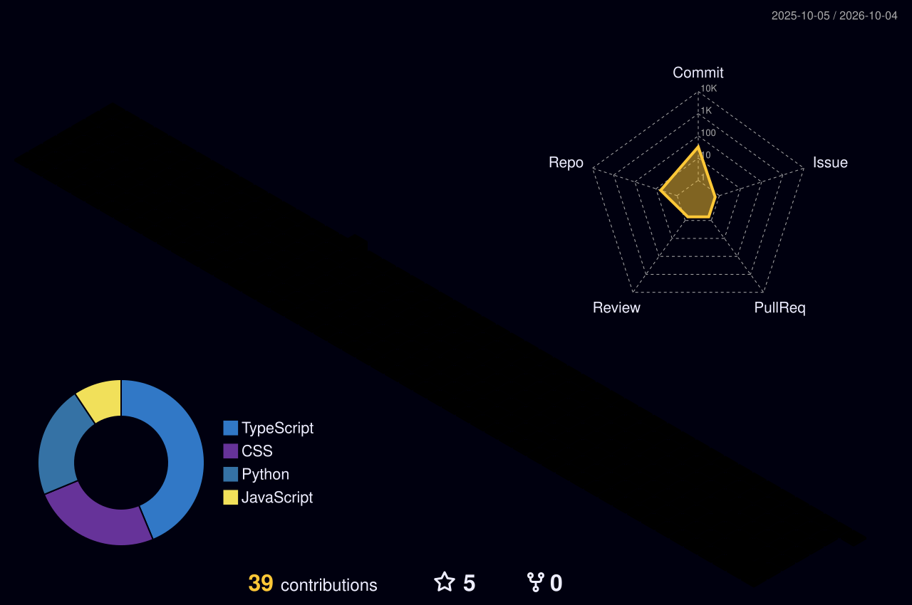

  

  

  <h3>Software for the screen. Intelligence for the system. Electronics for the real world.</h3>
  
I’m Jithin, an ECE undergraduate building full-stack products, local-first AI experiences, and connected systems that turn complex ideas into useful tools.

  
  
  
  

 

## What I’m building

<table>
  <tr>
    <td width="50%" valign="top">
      <h3>✳ VibeDoc AI</h3>
      
AI-assisted documentation and architecture-diagram generation, built around a focused React workflow and LLM prompt pipelines.

      <code>React</code> <code>Tailwind CSS</code> <code>LLM pipelines</code>  
      <a href="https://jithinseemakurthi.github.io/jithinseemakurthi/#work">Interactive concept preview ↗</a> · <a href="https://github.com/search?q=user%3Ajithinseemakurthi+VibeDoc&type=repositories">Find source ↗</a>
    </td>
    <td width="50%" valign="top">
      <h3>◉ Life Shield / SafeChip x1</h3>
      
An AI-powered motorcycle safety concept connecting sensors, on-device intelligence, and emergency telemetry.

      <code>Embedded systems</code> <code>Sensors</code> <code>Edge AI</code>  
      <a href="https://jithinseemakurthi.github.io/jithinseemakurthi/#work">Interactive concept preview ↗</a> · <a href="https://github.com/search?q=user%3Ajithinseemakurthi+SafeChip&type=repositories">Find source ↗</a>
    </td>
  </tr>
  <tr>
    <td width="50%" valign="top">
      <h3>⌘ Interactive Data Structure Visualizer</h3>
      
A real-time visual sandbox for exploring algorithms and linear structures through direct interaction.

      <code>JavaScript</code> <code>Canvas</code> <code>Algorithms</code>  
      <a href="https://jithinseemakurthi.github.io/jithinseemakurthi/#work">Interactive concept preview ↗</a> · <a href="https://github.com/search?q=user%3Ajithinseemakurthi+%22Data+Structure+Visualizer%22&type=repositories">Find source ↗</a>
    </td>
    <td width="50%" valign="top">
      <h3>◇ Agentic Decision Intelligence Engine</h3>
      
A multi-agent orchestration concept exploring collaborative reasoning with locally deployed language models.

      <code>Python</code> <code>Ollama</code> <code>LangChain</code>  
      <a href="https://jithinseemakurthi.github.io/jithinseemakurthi/#work">Interactive concept preview ↗</a> · <a href="https://github.com/search?q=user%3Ajithinseemakurthi+Agentic+Decision&type=repositories">Find source ↗</a>
    </td>
  </tr>
</table>

Concept previews are interactive portfolio explorations. Source repositories and standalone live demos will be linked here when published.

  
<strong>Published projects and working demos</strong>

   
  <a href="https://github.com/jithinseemakurthi/geosentinel-ner">🌍 GeoSentinel-NER</a> — geospatial landslide early-warning platform · <code>Python</code> <code>FastAPI</code> <code>PostGIS</code> 
  <a href="https://github.com/jithinseemakurthi/VIBE_GUIDER">🧠 VIBE_GUIDER</a> — local-first AI workspace · <code>React</code> <code>TypeScript</code> <code>Ollama</code> · <a href="https://vibe-guider.vercel.app">Live demo ↗</a> 
  <a href="https://github.com/jithinseemakurthi/Predictive-Maintenance-AI">⚙ Predictive-Maintenance-AI</a> — equipment telemetry dashboard · <code>React</code> <code>TypeScript</code> · <a href="https://jithinseemakurthi.github.io/Predictive-Maintenance-AI/">Live demo ↗</a> 
  <a href="https://github.com/jithinseemakurthi/phoneinfo-live-location">⌖ PhoneInfo Live Location</a> — consent-based real-time location sharing · <code>Node.js</code> <code>WebSockets</code> 
  <a href="https://github.com/jithinseemakurthi/lavanya-bangles">✧ Lavanya Bangles</a> — interactive 3D storefront · <code>Three.js</code> <code>JavaScript</code>

## Tech stack

**Languages** 

**Frontend & UI** 

**Backend & AI** 

**Core hardware & ECE** 

## The contribution graph, in 3D

  <picture>
    <source media="(prefers-color-scheme: dark)" srcset="./profile-3d-contrib/profile-night-rainbow.svg" />
    
  </picture>

## GitHub activity

  
  

  Always learning. Always building. Always connecting the dots.

